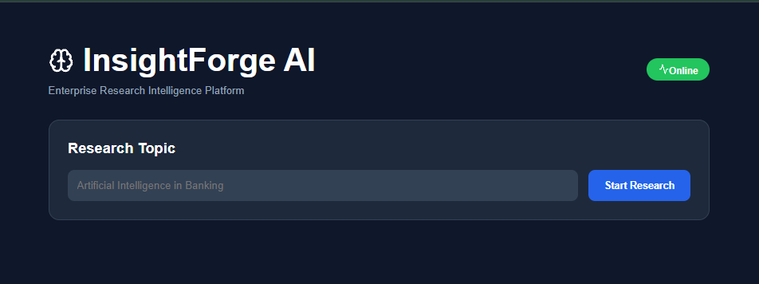
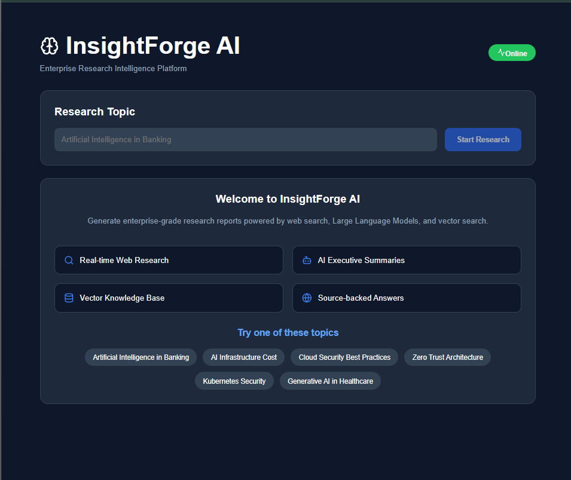
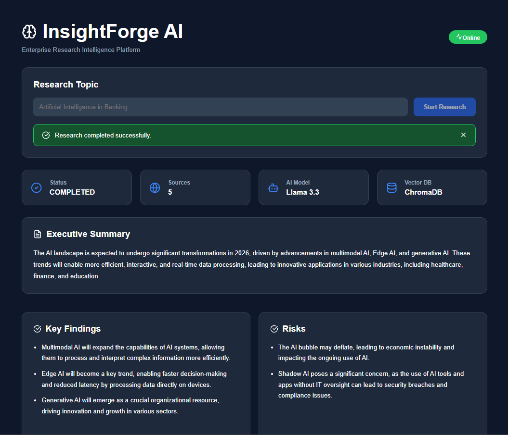
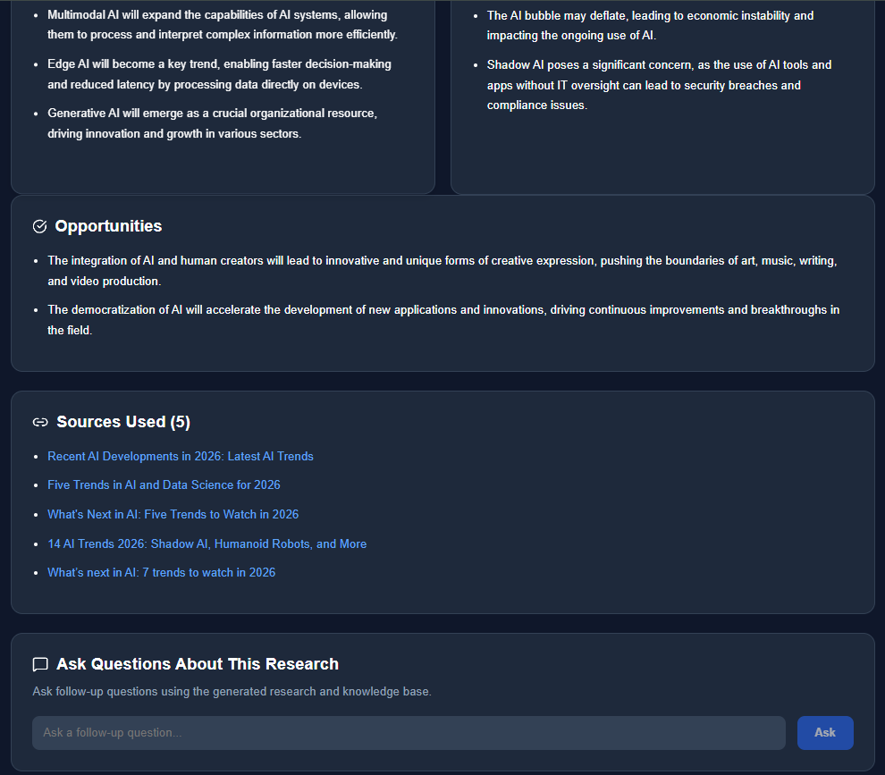
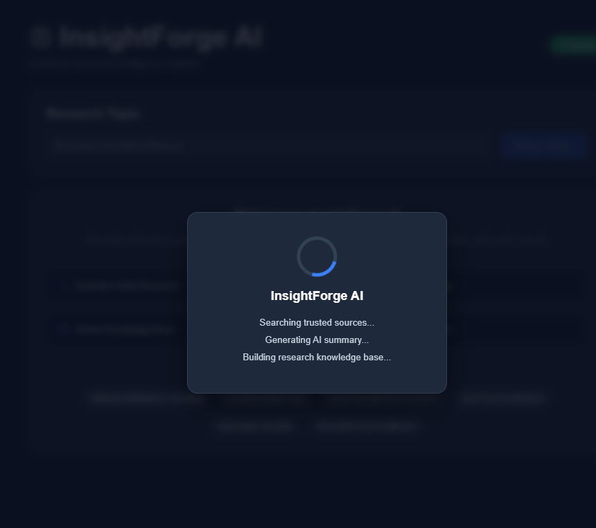

# 🧠 InsightForge AI

> **Enterprise AI Research Intelligence Platform**

Generate enterprise-grade research reports using **FastAPI**, **React**, **Groq**, **Tavily Search**, and **ChromaDB**.

---

## 🚀 Built With


---

## 📌 Overview

InsightForge AI is an enterprise-grade AI research platform that automates the process of gathering, summarizing, and analyzing information from trusted web sources.

The application combines **real-time web search**, **Large Language Models**, and **Retrieval-Augmented Generation (RAG)** to produce high-quality research reports with source-backed answers.

Users can generate research on any topic, explore executive summaries, review key findings, identify risks and opportunities, and ask follow-up questions against the generated knowledge base.


---

# ✨ Features

### 🔍 AI Research

- Real-time web research using Tavily Search
- Automatic executive summaries
- Structured AI-generated reports
- Source-backed research

---

### 📄 Research Reports

Each report includes:

- Executive Summary
- Key Findings
- Risks
- Opportunities
- Source References

---

### 🤖 AI Chat

- Retrieval-Augmented Generation (RAG)
- Context-aware follow-up questions
- Vector similarity search
- Source-grounded responses

---

### 💻 Enterprise Dashboard

- Responsive React interface
- Loading overlay
- Interactive statistics
- Source explorer
- AI chat interface


---

# 🏗 System Architecture

```text
                    React Frontend
                           │
                           ▼
                    FastAPI Backend
                           │
          ┌────────────────┼────────────────┐
          │                │                │
          ▼                ▼                ▼
     Tavily Search     Groq LLM         SQLite
          │
          ▼
     Web Search Results
          │
          ▼
 Sentence Transformers
          │
          ▼
       ChromaDB
          │
          ▼
   Retrieval-Augmented Chat
```

---

# 📸 Application Preview

## Landing Page



---

## Research Dashboard



---

## AI Chat




---

## Loading Screen


---

# 🛠 Tech Stack

## Frontend

| Technology | Purpose |
|------------|----------|
| React | User Interface |
| Vite | Build Tool |
| Lucide React | Icons |
| CSS3 | Styling |

## Backend

| Technology | Purpose |
|------------|----------|
| FastAPI | REST API |
| SQLAlchemy | ORM |
| SQLite | Database |
| Pydantic | Data Validation |

## AI & Search

| Technology | Purpose |
|------------|----------|
| Groq | Large Language Model |
| Tavily Search | Web Research |
| ChromaDB | Vector Database |
| Sentence Transformers | Embedding Generation |

## 📁 Project Structure

---

# 📁 Project Structure

```text
enterprise-ai-research-agent/

├── backend/
│   ├── app/
│   │   ├── api/
│   │   ├── chat/
│   │   ├── core/
│   │   ├── database/
│   │   ├── models/
│   │   ├── schemas/
│   │   ├── services/
│   │   ├── vectorstore/
│   │   └── main.py
│   │
│   ├── chroma_db/
│   ├── requirements.txt
│   └── .env
│
├── frontend/
│   ├── src/
│   │   ├── components/
│   │   ├── pages/
│   │   ├── services/
│   │   ├── styles/
│   │   ├── App.jsx
│   │   └── main.jsx
│   │
│   ├── package.json
│   └── vite.config.js
│
└── README.md
```

---

# 🚀 Getting Started

## 1. Clone the Repository

```bash
git clone https://github.com/<your-username>/enterprise-ai-research-agent.git

cd enterprise-ai-research-agent
```

---

## 2. Backend Setup

```bash
cd backend

python -m venv venv

venv\Scripts\activate

pip install -r requirements.txt

uvicorn app.main:app --reload
```

Backend runs on:

```
http://localhost:8000
```

Swagger UI:

```
http://localhost:8000/docs
```

---

## 3. Frontend Setup

```bash
cd frontend

npm install

npm run dev
```

Frontend runs on:

```
http://localhost:5173
```

---

# 🔑 Environment Variables

Create a `.env` file inside the **backend** folder.

```env
GROQ_API_KEY=your_groq_api_key

TAVILY_API_KEY=your_tavily_api_key
```

---

# 📡 API Endpoints

## Generate Research

```http
POST /research
```

Example Request

```json
{
  "topic": "Artificial Intelligence in Banking"
}
```

---

## Ask Questions

```http
POST /chat
```

Example Request

```json
{
  "question": "What are the major risks?"
}
```

---

# 🧠 AI Workflow

```text
User enters research topic
            │
            ▼
     Tavily Web Search
            │
            ▼
   Collect trusted sources
            │
            ▼
      Groq LLM generates
      structured summary
            │
            ▼
 Sentence Transformer
 creates vector embeddings
            │
            ▼
     Store in ChromaDB
            │
            ▼
User asks follow-up question
            │
            ▼
 Similar documents retrieved
            │
            ▼
 Groq generates grounded answer
```
---

# 🔮 Future Enhancements

- Research history
- PDF report export
- Authentication
- User profiles
- Streaming AI responses
- Multi-model support
- Advanced filtering
- Research comparison

---

# 👨‍💻 Author

**Rikson Pinto**

Cloud | AWS | DevOps | AI Engineering

If you found this project interesting, feel free to connect and provide feedback.

---

⭐ If you like this project, consider giving it a star on GitHub.